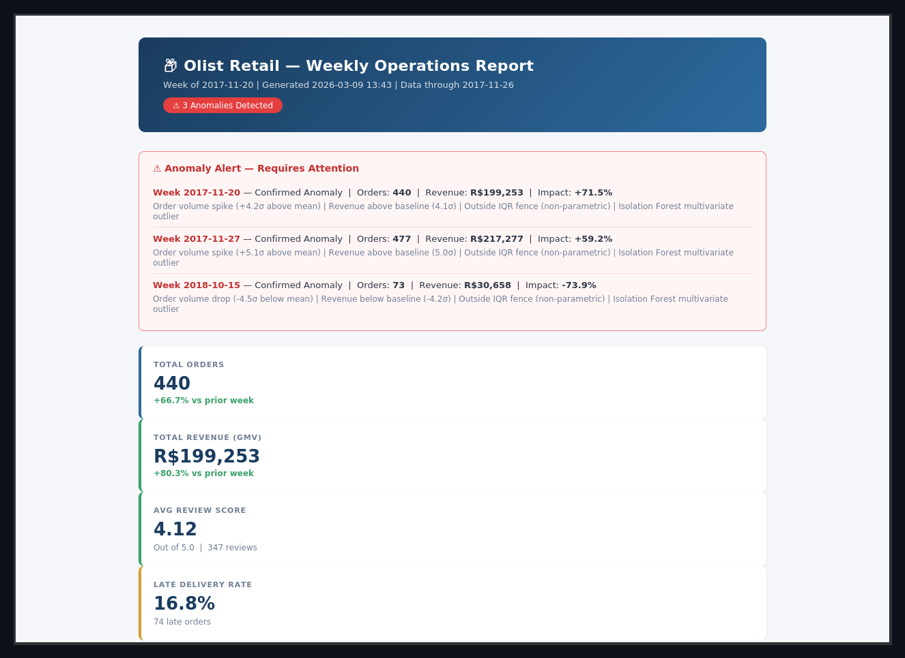
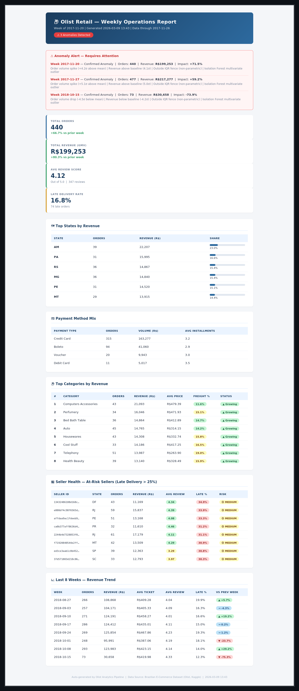

#     Retail Operations Analytics 

> Retail Analytics Pipeline: ETL · Anomaly Detection · Automated Reporting · SQL Analytics


---

## Business Problem

Olist operates Brazil's largest e-commerce marketplace aggregator.
Their raw data: **9 disconnected CSVs, 100K+ orders, 8 hours/week manual reporting, zero anomaly alerting.**

This pipeline solves all four gaps.

---

## 📁 Project Structure

```
olist-analytics-pipeline/
├── src/
│   ├── etl/
│   │   ├── data.py    
│   │   ├── extract.py           
│   │   ├── transform.py         
│   │   ├── load.py              
│   │   └── pipeline.py         
│   ├── anomaly/
│   │   └── detector.py          
│   ├── sql/
│   │   └── runner.py            
│   ├── reports/
│   │   └── builder.py           
│   └── utils/
│       ├── config_loader.py     
│       ├── logger.py            
│       └── db.py                
├── configs/
│   └── config.yaml              
├── data/
│   ├── raw/                     
│   └── processed/               
├── database/
│   └── olist.db                 
├── templates/
│   └── weekly_report.html       
├── reports/                     
├── tests/
│   └── test_etl.py                                
├── main.py                      
├── dvc.yaml                    
├── requirements.txt
├── setup.py
└── .gitignore
```

---

##  Start on your machine

```bash
# 1. Clone
git clone https://github.com/YOUR_USERNAME/olist-analytics-pipeline.git
cd olist-analytics-pipeline

# 2. Virtual environment
python3 -m venv .venv
source .venv/bin/activate          # Windows: .venv\Scripts\activate

# 3. Install dependencies
pip install -r requirements.txt
pip install -e .                   # install src/ as a package


# 5. Run full pipeline
python main.py

# 6. Open a report
open reports/weekly_report_2017-11-20.html
```

---

## Architecture

```
data/raw/*.csv (9 CSVs)
      │
      ▼
┌─────────────────────────────────────────┐
│  ETL Pipeline  (src/etl/)               │
│  extract → transform → load             │
│  ├── 12 feature engineering steps       │
│  ├── fact_orders (master join table)    │
│  ├── weekly_agg  (time-series base)     │
│  └── seller_scorecard (health metrics) │
└───────────────┬─────────────────────────┘
                │
       ┌────────┴────────┐
       ▼                 ▼
  database/olist.db   data/processed/*.csv
       │                 │
       ├──► SQL Runner   └──► Power BI
       │    (8 queries)
       │
       ▼
┌─────────────────────────────────────────┐
│  Anomaly Detection  (src/anomaly/)      │
│  Z-Score + IQR + Isolation Forest      │
│  → consensus confidence level          │
│  → revenue impact vs baseline          │
└───────────────┬─────────────────────────┘
                │
                ▼
┌─────────────────────────────────────────┐
│  Report Generator  (src/reports/)       │
│  Jinja2 HTML, KPIs, anomaly alerts,    │
│  category Pareto, seller risk table    │
└─────────────────────────────────────────┘
```

---

##  Dataset

[Brazilian E-Commerce Public Dataset by Olist](https://www.kaggle.com/datasets/olistbr/brazilian-ecommerce) | Kaggle | CC BY-NC-SA 4.0

| Table | Real Rows | Description |
|---|---|---|
| olist_orders | 99,441 | Order lifecycle |
| olist_order_items | 112,650 | Products per order |
| olist_order_payments | 103,886 | Payment type + installments |
| olist_order_reviews | 99,224 | Review scores + comments |
| olist_customers | 99,441 | Customer geolocation |
| olist_sellers | 3,095 | Seller geolocation |
| olist_products | 32,951 | Category + dimensions |
| geolocation | 1,000,163 | ZIP → lat/lon |
| category_translation | 71 | PT → EN names |

---

##  Key Findings

**Anomaly Detection (112 weeks)**
- Black Friday 2017: **+5.1σ spike**, R$217K revenue, 477 orders (+52.8% vs baseline)
- Isolation Forest caught 2 additional anomalies Z-Score alone missed

**SQL Analytics**
- Late delivery → review score drops **0.26 points per day** of delay
- Top 4 categories = **78% of GMV** (Pareto confirmed)
- States AM + PA: freight cost **>22% of order revenue** = structural margin risk

---
---

## Weekly Report — Live Preview

> Auto-generated Jinja2 HTML report · Black Friday week 2017-11-20 · Anomaly alerts live

### Above the Fold — KPIs & Anomaly Alerts


### Full Report Scroll — Categories, Seller Risk, 8-Week Trend


---

##  Tech Stack

| Layer | Tech |
|---|---|
| Data generation | Python (pure stdlib + pandas) |
| ETL | pandas, numpy, sqlite3 |
| Storage | SQLite → swap to PostgreSQL in prod |
| Statistical anomaly | scipy.stats Z-score, IQR |
| ML anomaly | sklearn IsolationForest |
| Templating | Jinja2 |
| Config | PyYAML |
| Data versioning | DVC |
| Testing | pytest |
| Visualisation | Power BI (see data/processed/*.csv) |

---


---

##  License

MIT. Dataset: CC BY-NC-SA 4.0 (Olist, Kaggle 2018).
